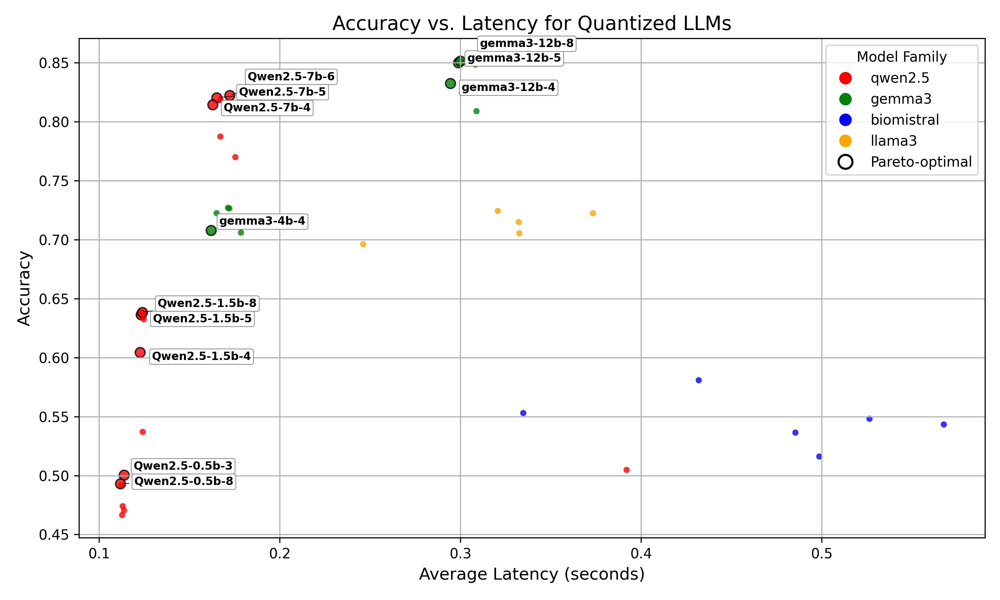
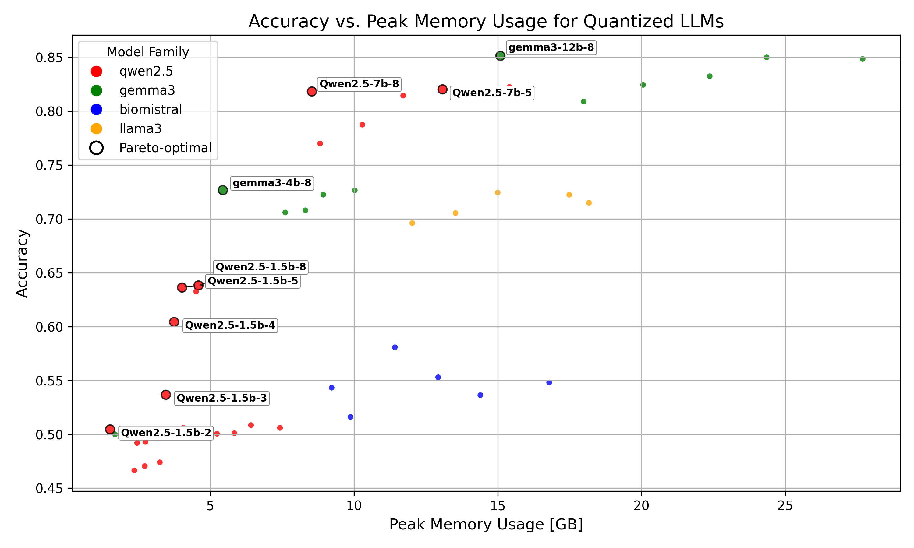

# Quantized LLM Hallucination Detection
### 🧠 About This Project
This repository contains the full code and results for my undergraduate Engineering Science thesis at the University of Toronto (2025).

**Title**: Quantized LLM Hallucination Detection  
**Advisor**: Prof. Andreas Moshovos  
**Dataset**: MedHallu (medical hallucination QA dataset)  
**Goal**: Evaluate the effects of k-bit quantization on hallucination detection accuracy, latency, and GPU usage across 4 LLM families (Qwen2.5, Gemma3, LLaMA3, Biomistral).

This repository evaluates the impact of k-bit quantization on the ability of a Large Language Model (LLM) to detect hallucination(s) in answers to medical questions. The `run-llm-exp.py` script support inference and benchmarking across multiple models and quantization schemes. The currently supported models and quantization schemes are listed below in the 'Experiment Design' section, but more models/quantization schemes can be introduced by adding config files for what you'd like to add, to the `conf/` folder in the repo.

Example cli usage of `run-llm-exp.py`, with gemma3 (instruction tuned) 1B parameter model, using the q4_k_m GGUF quantized version.
```
python run-llm-exp.py model=gemma3-1b-it quantization=gguf quantization.level=q4_k_m max_samples=10
```

## Features
- [x] Hydra-powered CLI interface via `run-llm-exp.py`
- [x] Support binary hallucination classification across 10 models x 6 quantization levels
- [x] Outputs include:
  - JSON logs of system + model metrics
  - CSV of model predictions, ground truths, extracted model judgements
  - Confusion matrix metrics, abstention rate, inference latency, and GPU usage statistics

## Project Status

- ✅ Most models completed (see Results section)
- ⚠️ Some larger models skipped due to sharded GGUF format incompatibility and time constraints
- 🛠️ Actively running final models to complete benchmarks

Each experiment records a number of metrics:
* Confusion matrix: Accuracy, precision, recall, f1 score, support
* Abstention rate
* Inference latency statistics (e.g., peak, avg, std_dev, variance)
* GPU usage statistics (e.g., peak, avg, std_dev for GPU load, utilization)

## Experiment Design
### Models
- 💊 biomistral-7b-med
- 💊 llama3-med
- 🧠 gemma3-{1b, 4b, 12b}-it
- 🧠 qwen2.5-{0.5b, 1.5b, 3b, 7b}-it
- 🧠 qwen2.5-7b-it-med
- ~~qwen2.5-14b-it~~ – skipped due to unsupported sharded GGUF
- ~~qwen2.5-32b-it~~ – skipped for same reason

### Quantization Schemes (GGUF)
All models (except skipped ones) are evaluated with the following GGUF quantization levels:

`q8_0`, `q6_k`, `q5_k_m`, `q4_k_m`, `q3_k_m`, `q2_k`

## Results

The plots below show the tradeoff between accuracy and a system performance metric (e.g., latency, peak GPU memory usage).
Pareto dominant model configurations are annotated within each plot.

<p align="center">
  
  <br/>
  <em>Accuracy vs. Latency Pareto Frontier</em>
</p>

<p align="center">
  
  <br/>
  <em>Accuracy vs. Peak Memory Usage</em>
</p>

### Completed Experiment Runs
- **BioMistral 7B** — 6 quantization levels
- **LLaMA3-med** — 5 quantization levels (missing q2_k)
- **Gemma3-12B** — 6 quantization levels
- **Gemma3-4B** — 6 quantization levels
- **Gemma3-1B** — 6 quantization levels
- **Qwen2.5-7B-it** — 6 quantization levels
- **Qwen2.5-3B-it** — 6 quantization levels
- **Qwen2.5-1.5B-it** — 6 quantization levels
- **Qwen2.5-0.5B-it** — 6 quantization levels
